**Hosting a website with AWS S3 service**

Open the AWS management console and then search for S3 service.

create an S3 bucket. (I named it marvel-103 in N. Virginia region).

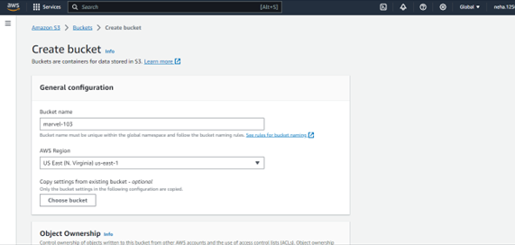

Open the public access settings for this bucket.

Uncheck the setting to block all the public access to the website, and
also enable the checkbox for the acknowledgement to turn of this block
setting.

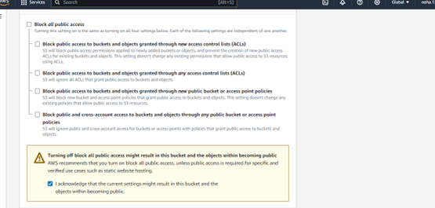

Click on create bucket.

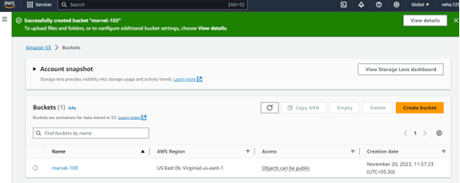{width="5.979166666666667in"
height="2.6979166666666665in"}

Now drag and drop the files from your local machine to the S3 bucket and
press the upload button.

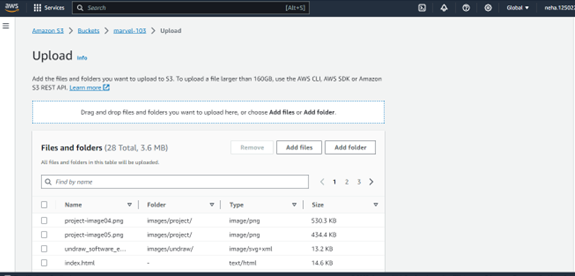{width="5.989583333333333in" height="2.875in"}

Now open the object ownership and enable the ACL's and save the changes.

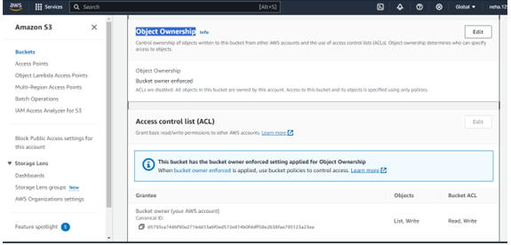{width="5.947916666666667in"
height="2.8541666666666665in"}

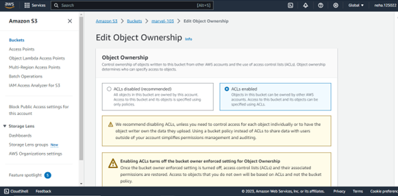{width="6.052083333333333in"
height="2.9791666666666665in"}

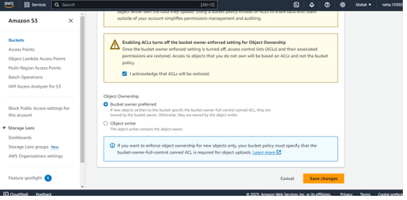{width="5.989583333333333in"
height="2.9166666666666665in"}

Open the uploads and select all the objects. Click on actions button and
select Make public using ACL's. click "Make Public" and save this.

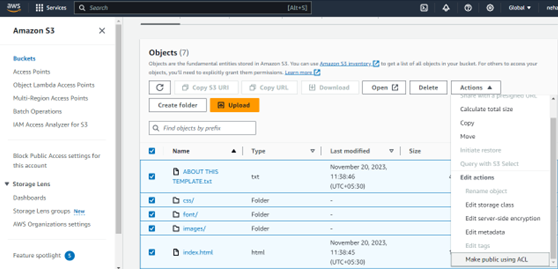{width="5.989583333333333in"
height="2.8020833333333335in"}

Open the edit static website hosting, and enable it. Fill the name of
index document of the project. then save it.

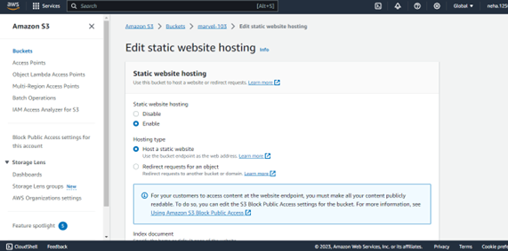{width="5.947916666666667in"
height="2.9479166666666665in"}

Copy the object URL and paste it in other tab of the browser.

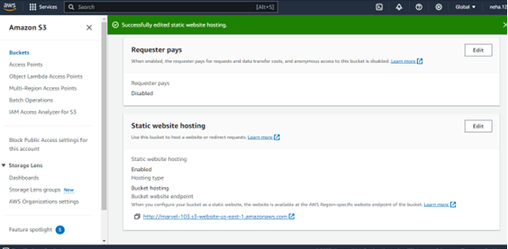{width="5.864583333333333in"
height="2.9270833333333335in"}

The result is the website.

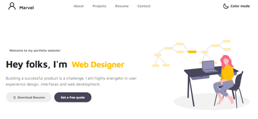{width="6.041666666666667in"
height="2.8958333333333335in"}

Reference: The website used was downloaded from the link

<https://www.tooplate.com/view/2115-marvel>
